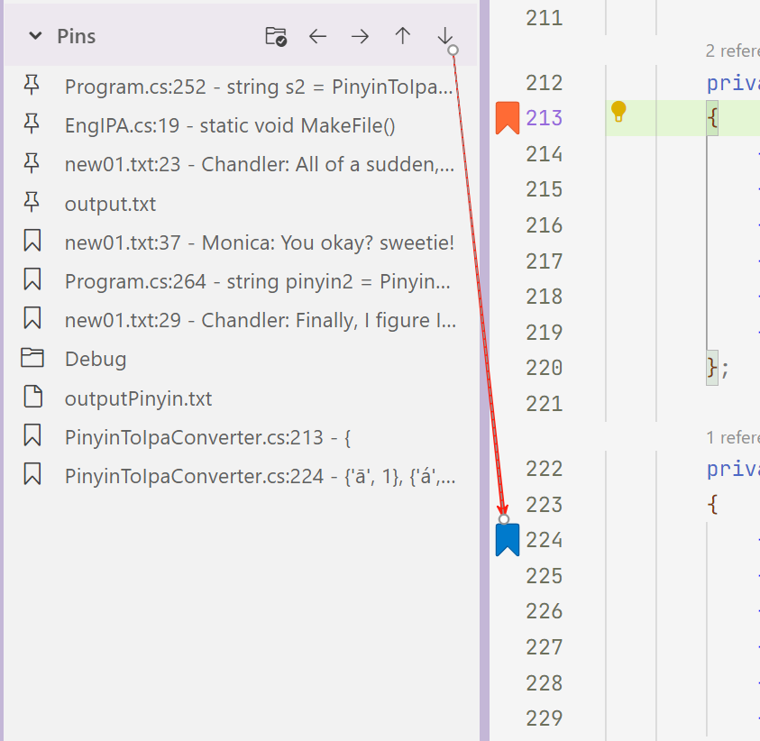

# PinInExplorer

## 功能 / Features

本 VSCode/TRAE/CURSOR 插件 "PinInExplorer" 允许您将常用的文件或文件夹固定到资源管理器的Pins视图中，同时支持代码的书签收藏和导航功能，方便快速访问。具体方法：在文件或文件夹或代码行上右键，选择"Pin"，即可固定到Pins视图中。

The VSCode/TRAE/CURSOR plugin "PinInExplorer" allows you to pin frequently used files or folders to the Pins view in the explorer. It also supports code bookmarking and navigation functions for easy quick access.

Specific method: Right-click on a file, folder, or line of code, and select "Pin" to pin it to the Pins view.

### 主要功能 / Main Features

#### 固定操作 / Pin Operations
- **Pin/Unpin**: 在文件资源管理器中右键文件或文件夹，选择"Toggle Pin"来固定或取消固定项目
- **Pin/Unpin**: Right-click on files or folders in the file explorer and select "Toggle Pin" to pin or unpin items

#### Pins视图中的4个功能按钮 / 4 Function Buttons in Pins View

1. **📂 打开 / Open Button**
   - 功能：直接打开固定的文件或文件夹
   - Function: Directly open the pinned file or folder

2. **⬆️ 上移 / Move Up Button**
   - 功能：将选中的项目在列表中向上移动一位
   - Function: Move the selected item up one position in the list

3. **⬇️ 下移 / Move Down Button**
   - 功能：将选中的项目在列表中向下移动一位
   - Function: Move the selected item down one position in the list

4. **📌 置顶/取消置顶 / Pin to Top/Remove from Top Button**
   - 功能：将项目置顶显示或从置顶位置移除
   - 置顶的项目会显示在列表最前面，并有特殊的图标标识
   - Function: Pin items to the top of the list or remove them from the top position
   - Pinned-to-top items are displayed at the beginning of the list with special icon indicators

#### 代码书签 / Code Bookmarks
- **添加书签 / Add Bookmark**: 在代码编辑器中右键选择"Toggle Pin"来添加或移除书签
- **书签显示 / Bookmark Display**: 书签会显示在Pins视图中，格式为"文件名:行号 - 代码内容"
- **快速跳转 / Quick Navigation**: 点击书签可直接跳转到对应的代码位置
- **书签管理 / Bookmark Management**: 支持置顶、移除、删除等操作
- **自动清理 / Auto Cleanup**: 自动清理不存在文件的书签

- **Add Bookmark**: Right-click in the code editor and select "Toggle Pin" to add or remove bookmarks
- **Bookmark Display**: Bookmarks are displayed in the Pins view with format "filename:line - code content"
- **Quick Navigation**: Click on bookmarks to jump directly to the corresponding code position
- **Bookmark Management**: Support operations like pin to top, remove, delete, etc.
- **Auto Cleanup**: Automatically clean up bookmarks for non-existent files

**使用方法 / Usage:**
1. 在代码编辑器中将光标定位到要标记的行 / Position cursor on the line to bookmark in code editor
2. 右键选择"Toggle Bookmark" / Right-click and select "Toggle Bookmark"
3. 书签会自动添加到Pins视图中 / Bookmark will be automatically added to Pins view
4. 点击书签可跳转到对应位置 / Click bookmark to jump to corresponding position

#### 文件夹焦点 / Folder Focus
- **自动焦点切换 / Auto Focus Switch**: 当删除文件后（文件夹内的最后一个文件），如果其父文件夹变为空，会自动将资源管理器焦点切换到该文件夹
- **功能开关 / Feature Toggle**: 在Pins视图标题栏中点击文件夹图标可开启或关闭此功能
- **智能检测 / Smart Detection**: 仅在文件夹完全为空时才触发焦点切换，避免不必要的干扰

- **Auto Focus Switch**: When a file is deleted(the last one) and its parent folder becomes empty, the explorer focus will automatically switch to that folder
- **Feature Toggle**: Click the folder icon in the Pins view title bar to enable or disable this feature
- **Smart Detection**: Focus switching is triggered only when the folder is completely empty, avoiding unnecessary interruptions

### 开发调试 / deployment 
- 开发、编译、部署请参考Development.md。
- For the steps of development, compilation and deployment, please refer to Development.md.

### MIT License

Copyright (c) 2025-07 tony.tian

https://github.com/tony-long-xi/PinInExplorer
